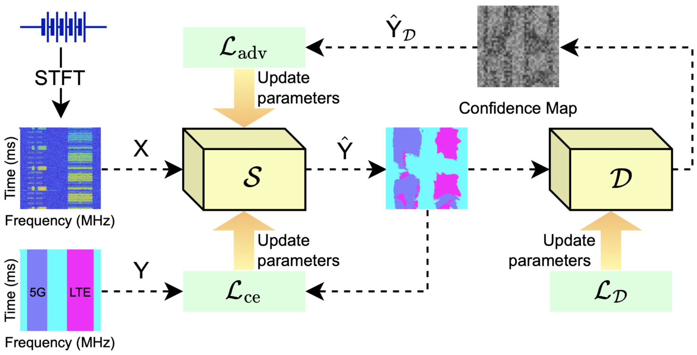
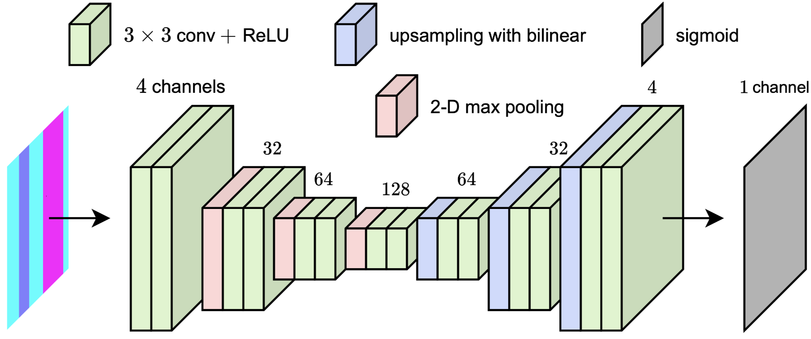

# Adversarial Training Approach for Signal Identification in 5G-LTE Spectrum Sensing

Spectrum sensing plays a key role in identifying wireless signals, especially when 5G and LTE share the same frequency band. However, training models for this task faces challenges such as limited real-world data, signal distortion due to noise and channel effects, and the limitations of traditional loss functions in distinguishing signals from noise. These issues call for advanced training strategies to improve detection accuracy.

This paper proposes an Adversarial Training Approach (ATA) to improve the segmentation of 5G and LTE signals from spectrograms. ATA integrates a lightweight discriminator network into the training loop, which acts as an additional supervisory signal. Unlike traditional methods that rely solely on pixel-wise loss, ATA encourages the segmentation model to generate outputs that not only match the ground truth but also fool the discriminator. This adversarial feedback enables the model to learn finer spectral details under noise and channel impairments. Experimental results show that ATA improves performance across various segmentation models without modifying their architectures, highlighting its effectiveness, generality, and efficiency.

The Python code and dataset provided here are included in the paper at IEEE Wireless Communications Letters.

Hai-Trang Phuoc Dang, Huu-Tai Nguyen, Quoc-Viet Pham, Van-Ca Phan, and Thien Huynh-The, "Adversarial Training Approach for Signal Identification in 5G-LTE Spectrum Sensing", IEEE Wireless Communications Letters, 2025. [[Link](https://ieeexplore.ieee.org/abstract/document/11222698)]

The dataset can be dowloaded from [Kaggle](https://www.kaggle.com/datasets/huutai23012003/j03-dataset/data). Please report if it is not available.

If there are any errors or topics that need to be discussed, please contact [Huu-Tai Nguyen](github.com/HuuTaiNg) via email at n.huutai231@gmail.com.

